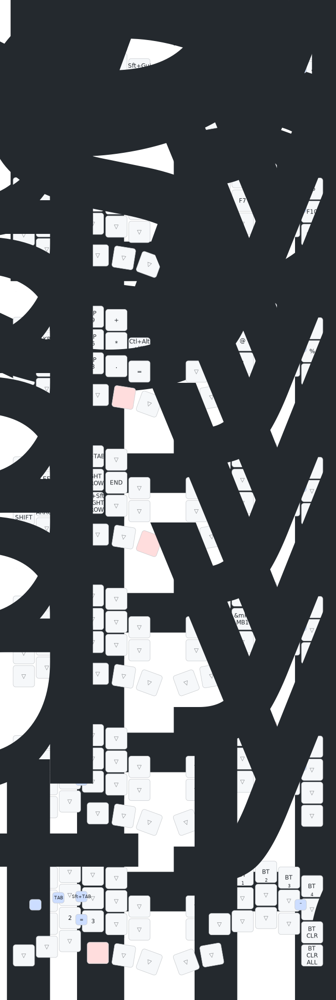

# zmk-config-roBa

AI agent guidance is maintained in [AGENTS.md](AGENTS.md). Claude Code and Cursor bridge files should defer to it for project rules.

## roBa Keymap Viewer

Windows ではリポジトリ直下の `start-roba-viewer.cmd` をダブルクリックすると、ローカル viewer/editor が起動してブラウザが開きます。終了するときは `stop-roba-viewer.cmd` を使います。

初回だけ依存関係が無い場合は `tools\roba-keymap-viewer` で `npm install` を実行してください。

