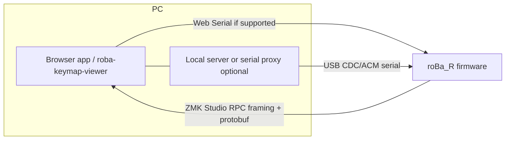

# Studio 代替アプリ開発計画（`studio_alt_app`）

このドキュメントは、**ZMK Studio 本体を主 UI とせず**、**GitHub Actions を日常の変更経路にしない**ことを目標としたブラウザ＋ローカル環境からの roBa 実機編集について、恒久方針・技術前提・マイルストーン・UI 原則をまとめたものです。

日々の進捗や直近タスクは `docs/current-work-status.md` に書き、このファイルにはブレさせたくない要件と設計判断の骨格だけを載せます。

---

## 1. 背景とゴール

### 背景

- リポジトリには `tools/roba-keymap-viewer/` に keymap を扱うローカルアプリがあり、`config/roBa.keymap` 等を正本として読み書きできる。
- 実機側は **ZMK Studio 対応ファーム**（右半分 `roBa_R`: `CONFIG_ZMK_STUDIO=y`、`build.yaml` で `snippet: studio-rpc-usb-uart`）が載る想定。
- 公式 ZMK Studio には Web 版と native app があり、USB/BLE 経由で runtime keymap update ができる。したがって本計画の価値は「公式 Studio の再実装そのもの」ではなく、**既存 viewer の `.keymap` 編集資産・roBa 固有 UI・Git 管理される設定との同期方針**を一体で扱う点に置く。

### 自前実装／viewer 統合を検討する理由

- 既存 `tools/roba-keymap-viewer/` の `.keymap` パース、source-range 置換、保存前バリデーション、keymap-drawer 更新、安全なバックアップ復元を活かしたい。
- 実機上の Studio settings と、リポジトリ内の `config/roBa.keymap` / `config/roBa.json` の差分を明示し、どちらを正として扱うかをユーザーが判断できる UI にしたい。
- roBa 固有の trackball / encoder / layer 運用に合わせ、「実機直接でよい変更」と「Git 経路・再ビルドが必要な変更」を同じ画面で区別したい。

### ゴール

| # | 内容 |
|---|------|
| 1 | **USB 経由**で PC と右半分（`roBa_R`）を接続し、そこ経由で実機への書き換えを行う。 |
| 2 | USB 接続時に **実機上の現在設定を読み込める**ようにする。ただし、実機 settings と repo `.keymap` のどちらを正本にするかは操作ごとに明示する。 |
| 3 | **allowlist で安全と確認した範囲**の編集をアプリから実機へ直接反映する（Studio アプリ本体は主 UI として使わない）。 |
| 4 | 上記で **対応できないもの** は、従来どおり **GitHub 経由でキーマップ（および必要なら `.conf`/DTS）を変更しビルド・書き換え**するワークフローに逃がす。 |
| 5 | アプリの **UI/UX で「3 でできること」と「4 が必要なこと」を明確に区別**し、ユーザーが経路を取り違えないようにする。 |

あわせて定める範囲外:

- **スマホからの変更**は不要（本計画では扱わない）。
- PC は **Chromium 系ブラウザ＋ローカルサーバー**、または必要に応じて Web Serial とローカルプロキシの併用を前提とする。
- 公式 ZMK Studio の全機能互換は目標にしない。

---

## 2. ハード・ファーム前提

- MCU / ボード: `seeeduino_xiao_ble`、シールド **roBa**。
- Studio RPC の典型接続対象は **物理右半分 `roBa_R`**（USB）。本リポジトリでは `roBa_R.conf` に `CONFIG_ZMK_STUDIO=y` / `CONFIG_ZMK_STUDIO_LOCKING=n` があり、`build.yaml` の `roBa_R` に `snippet: studio-rpc-usb-uart` が付いている。
- `config/west.yml` の ZMK は `v0.3-branch`、`zmk-pmw3610-driver` は `main`。この pin は、ユーザーが明示的に求めない限り本計画と同じ変更で動かさない。
- BLE HID 出力と USB CDC/ACM Studio RPC は別の論点として扱う。ZMK Studio 公式 docs では、USB と BLE の両 endpoint に接続している場合、Studio 接続先と keyboard output endpoint を揃える運用が示されている。roBa でも M0 で `&out OUT_USB` 等の必要性を確認する。
- ZMK Studio Locking は roBa_R で無効化されている。USB 接続できるローカルプロセスが実機設定を書ける前提になるため、セキュリティ影響を ADR と UI 表示に含める。
- ファームの pin、配線、Studio snippet、左右設定の役割は `AGENTS.md` の規約に従う。

---

## 3. アプリ境界（論理アーキテクチャ）

- **Web Serial 単体**で済む構成と、**Node/Python が COM を開いてブラウザに中継**する構成はどちらもありうる。初期は実装コスト、デバッグ性、ブラウザ制約で選ぶ。
- Web Serial は secure context が必要で、2026 年 5 月時点では Chromium 系ブラウザ前提。Chrome/Edge を公式サポート対象とし、Firefox/Safari は対象外として扱う。
- プロトコルは **ZMK Studio RPC**（フレーミング＋Protocol Buffers）。メッセージ定義は公式の `zmk-studio-messages` および [ZMK Studio RPC Protocol](https://zmk.dev/docs/development/studio-rpc-protocol) を正とする。
- ローカルプロキシを採用する場合は、単なる実装詳細ではなく **セキュリティ境界**として扱う。少なくとも `127.0.0.1` bind、ランダムなセッショントークン、許可 origin、同時接続排他、ログに keymap / serial / token を漏らさない方針を ADR で決める。
- 実装時は、参照するリポジトリのライセンスと ZMK の clean room policy の意味を分けて確認する。ここでの clean room は主に GPL 系実装の混入回避と、ZMK へ upstream する可能性があるコードの参照範囲を整理するためのものとし、MIT / Apache-2.0 の公式リポジトリを使う場合のライセンス遵守確認とは別項目にする。

---

## 4. 正本・永続化モデル

ZMK Studio は runtime keymap update を settings 側に保存する。公式 docs では、Studio で keymap を管理し始めた後の `.keymap` 変更は、Restore Stock Settings しない限り反映されないと説明されている。したがって本計画では「再ビルドすれば常に `.keymap` が勝つ」とは扱わない。

### 4.1 正本の候補

| 正本候補 | 強み | リスク |
|---|---|---|
| 実機 settings | 現在の実機挙動に近い。USB 接続だけで編集できる。 | repo `.keymap` と乖離する。settings reset / Restore Stock Settings / 容量不足で失われる可能性がある。 |
| repo `.keymap` | Git でレビュー・履歴管理できる。keymap-drawer と整合しやすい。 | Studio settings が残ると、再ビルド後も `.keymap` 変更が期待通り反映されない場合がある。 |
| 明示的な同期レイヤー | 差分を見せて選べる。誤操作を減らせる。 | 実装が重い。`.keymap` AST の往復可逆性が必要になる。 |

### 4.2 運用方針

- M0 以降、接続時に **実機 state と repo `.keymap` の差分有無**を UI に表示する。
- 4.1 の正本候補は M-1 で正式決定する。現時点の有力案は、実機 settings と repo `.keymap` のどちらか一方を暗黙の正本にせず、差分を明示してユーザーが選べる **同期レイヤー**を置く案とする。
- 実機へ直接保存した変更は、可能なら repo `.keymap` への反映候補としてエクスポートする。ただし自動マージは M0/M1 の必須条件にしない。
- repo `.keymap` を変更して GitHub Actions build / UF2 flash する場合、実機側 Studio settings が残ると期待通り適用されない可能性があるため、Restore Stock Settings / settings reset の必要性を手順に含める。
- settings reset、Restore Stock Settings、NVS 容量不足、`SAVE_CHANGES_ERR_NO_SPACE` は復旧フローの対象にする。
- 本リポジトリの `build.yaml` は `settings_reset` をビルド対象に含む。復旧手順では **`settings_reset.uf2` を flash して persistent settings を消し、その後通常の roBa_R / roBa_L firmware を flash し直す経路**を名指しで扱う。ただし ZMK Studio の `Restore Stock Settings`、RPC `core.reset_settings`、`settings_reset.uf2` が消す範囲の違いは M-1 で確認する。

---

## 5. 「直接反映（3）」と「Git 経路（4）」の定義

### 5.1 直接反映（3）

次をすべて満たす操作を **「USB RPC で実機に保存できる」** とみなす。

- 対象デバイスが **Studio 有効ファーム**で、**USB 経路で RPC が利用可能**である。
- 操作が **現行の ZMK Studio RPC / `zmk-studio-messages` で表現・永続化できる**。
- `behavior_id` と `param1` / `param2` の対応を実機の behavior metadata または検証済み allowlist から安全に生成できる。
- 実機から読み出した内容と repo `.keymap` の差分を、ユーザーに隠したまま上書きしない。

実装では、RPC 呼び出しと 1:1 で対応づけ可能な編集単位を **「studio-direct」系**としてメタデータ化し、UI と保存フローを分岐させる（既存 viewer の `bindingDisplay` の編集性フラグの考え方と整合させる）。

### 5.2 Git 経路（4）が必要な例

次のようなものは **ファーム再ビルド・UF2 等の更新**が通常必要と割り切る（列挙は例示であり、調査で拡張する）。

- **`*.conf` / Kconfig**（ポインティング CPI、センサー、`CONFIG_*` の追加変更など）。
- **DeviceTree / `.overlay` / `.dtsi`**（配線・デバイスノード）。
- **RPC が表現しない、またはファームが解釈しない `.keymap` 構造**（高度なプリプロセッサ、カスタムマクロブロック、Studio 未対応のビヘイビア組み合わせなど）。
- **combos / macros / sensor-bindings / advanced behavior properties** のうち、確認時点の RPC allowlist に入っていないもの。
- **Studio settings の復旧や repo 正本への戻し**（Restore Stock Settings、RPC `core.reset_settings`、`settings_reset.uf2` のいずれを使うかは M-1 で整理する）。
- **ZMK のバージョンアップや新 snippet の追加**。

### 5.3 分類の運用ルール

- M0 から **allowlist 方式**にする。未対応操作は最初から保存不可にし、後付け blocklist にしない。
- **判定は機械可能ならコード側**（ビヘイビア種別・RPC メソッド有無・パース結果）で持ち、文言はテーブルやマニフェストから生成する。
- **実機から読んだが書き戻せないフィールド**は **読み取り専用** または **「要ビルド」パネル**に隔離し、通常の「保存→実機反映」と同じボタンに載せない。
- 公式 ZMK / メッセージリポジトリの更新に合わせ、**対応表（3/4）をメンテする責務**を PR レビュー観点に含める。

---

## 6. UI/UX 原則

1. **保存の意味を二系統に分ける**
   - **実機へ反映**: RPC `save_changes` 成功までが完了。ラベル例: 「実機に書き込む」。
   - **リポジトリ用**: `.keymap` 等のエクスポート、または「Git で編集が必要」の案内。ラベル例: 「ファイルに書き出す」「ビルドが必要」。
2. **接続状態の明示**: USB 未接続・RPC 失敗・別デバイス選択時は、実機反映をグレーアウトまたはブロックし理由を短く表示する。
3. **対応範囲の可視化**: 設定画面またはヘルプに **「この操作は実機直接 / 要ビルド」** の凡例と、主要ビヘイビアの対応表へのリンクを置く。
4. **バージョン表示**: RPC から取得できるデバイス情報、アプリ側 messages commit、対応 ZMK revision を表示し、将来の非互換の切り分けに使う。
5. **差分表示**: 実機 state と repo `.keymap` が異なる場合、保存前にどちらへ書く操作なのかを明示する。
6. **エラー時**: 「RPC 不可」は接続・ロック・ファーム不足・容量不足・未対応 RPC を区別してメッセージを出し、Git 経路または復旧手順へ誘導する。
7. **両方へ反映する操作**: 「実機に書き込む」と「repo 用にエクスポートする」は原則として二段操作にする。ワンクリックで両方へ反映する UI は、正本モデルと rollback 方針が固まるまで採用しない。
8. **Git 経路への誘導**: `.conf` / DTS / shield 定義の変更が必要な場合は、AGENTS.md の commit 分割ルール（keymap、`.conf`、shield / DeviceTree を可能な範囲で別 commit）を案内する。MVP ではアプリが `.conf` / DTS を直接編集しない。

---

## 7. マイルストーン

| 段階 | 内容 | 完了条件 |
|------|------|----------|
| **M-1** | 設計確定フェーズ。viewer 統合方針、正本モデル、RPC allowlist、protobuf/client 方針、テスト harness 方針を決める。 | 採用案を ADR または本書の節として確定し、未決定のまま M0 に進まない論点を残さない。 |
| **M0** | USB 接続の確立（Web Serial またはプロキシ）。デバイス情報、lock state、keymap 読み取り。allowlist 対象の 1 キー書き換え・永続化。 | 実機で往復確認。モックで framing / decode error / unlock required / RPC_NOT_FOUND を検証。未対応操作は保存不可。 |
| **M1** | layer 一覧、主要 tap/hold 系、layer rename など、RPC allowlist に入れた範囲を順次接続。viewer 側モデルとの同期方針を実装に落とす。 | 実機で代表操作を保存・再読込。モックで behavior metadata から UI 候補を生成。対応表を更新。 |
| **M2** | repo `.keymap` との同期・差分表示・エクスポート。Git 経路が必要な操作の検出と案内。 | 実機 state と repo `.keymap` の差分ケースをモックで再現。誤保存防止・外部変更検知・バックアップ復元の回帰テスト。 |
| **M3** | 複数ファーム／メッセージ版の互換メモ、エラーハンドリング強化、必要なら E2E の薄い自動化。 | 対応 ZMK revision / messages commit / roBa_R firmware 条件をリリースノートに明記。Chrome/Edge またはプロキシ経路の動作確認。 |

### M-1 完了条件

- **文書**: 公式 ZMK Studio を使わない理由と、公式 Studio を併用する場合の境界を 1 章に明記する。
- **文書**: 実機 settings / repo `.keymap` / Restore Stock Settings の関係を 4 章に明記する。
- **文書**: `tools/roba-keymap-viewer/` を拡張するか、新規アプリにするかを決める。
- **ADR**: 4.1 の正本候補から採用案を決める。同期レイヤーを採用する場合は、実機保存、repo エクスポート、両方へ反映の UI フローを決める。
- **ADR**: Web Serial 単体、ローカルプロキシ、`zmk-studio-ts-client` 利用、自前 protobuf 生成の候補を比較し、M0 で使う採用案を決定する。
- **ADR**: ローカルプロキシを採用する場合の port / token / origin / 同時接続排他 / ログ方針を決める。
- **ADR**: `zmk-studio-ts-client` が API 不足・更新停止・導入不能だった場合の Plan B（例: `zmk-studio-messages` から自前生成）を決める。
- **ADR**: モック test harness の置き場、言語、fixture 形式、framing / transport / RPC response の責務分割を決める。
- **調査**: `zmk-studio-messages` の現在の proto から、実装対象 RPC の実名と request / response / error enum を一覧化する。
- **調査**: `config/west.yml` の `v0.3-branch` と roBa_R build が、採用する Studio RPC / messages commit と整合することを GitHub Actions build または同等のビルドで確認する。
- **調査**: Restore Stock Settings、RPC `core.reset_settings`、`settings_reset.uf2` の違いと、split / BLE pairing への影響を整理する。

### M0 完了条件

- **実機テスト**: roBa_R を USB 接続し、device info / lock state / keymap read を取得できる。
- **実機テスト**: allowlist 対象の単純な 1 キー変更を `set_layer_binding` 相当で行い、`save_changes` 後に再接続しても残る。
- **実機テスト**: BLE HID 使用中 + USB RPC 接続時の挙動を確認し、`&out OUT_USB` 等の必要性を記録する。
- **実機テスト**: `CONFIG_ZMK_STUDIO_LOCKING=n` の状態で unlock 周りの挙動を確認する。
- **モックテスト**: message framing、escape、decode failure、unknown RPC、lock required、save error を再現できる。
- **回帰テスト**: 未対応 behavior / macro / combo / sensor-binding は UI 上で実機保存に進めない。

### M1 完了条件

- **実機テスト**: `&kp`、`&lt`、`&mt` など採用 allowlist の代表ケースを保存・再読込できる。
- **実機テスト**: layer rename と available/reserved layer の扱いを確認する。
- **モックテスト**: behavior metadata から picker 候補と `param1` / `param2` を安定生成できる。
- **回帰テスト**: 既存 viewer の `.keymap` source-range 保存、keymap-drawer 更新、保存前 validation が壊れていない。
- **文書**: 対応表に「実機直接」「要ビルド」「読み取り専用」を明記する。

### M2 完了条件

- **モックテスト**: 実機 state と repo `.keymap` が異なる状態を再現し、差分表示とユーザー選択が機能する。
- **回帰テスト**: Git 経路が必要な combos / macros / sensor-bindings / `.conf` / DTS は read-only または要ビルド表示になる。
- **回帰テスト**: 外部変更検知、保存前 validation、バックアップ復元が RPC 導入後も通る。
- **実機テスト**: settings reset / Restore Stock Settings 相当の操作後、repo 正本へ戻す手順を確認する。
- **実機テスト**: `settings_reset.uf2` を使う復旧手順を確認し、通常 firmware の再 flash まで含めて記録する。
- **回帰テスト**: repo エクスポート時に `config/roBa.json`、`keymap-drawer/roBa.yaml`、`keymap-drawer/roBa.svg` の更新要否を判定できる。
- **文書**: GitHub Actions build / UF2 flash に戻る手順と、Studio settings が残る場合の注意を明記する。
- **文書**: keymap-drawer 出力の更新責務を、アプリ側が自動実行するのか、手順としてユーザーに案内するのか明記する。

### M3 完了条件

- **モックテスト**: 既知 messages commit の fixture で encode/decode 互換を確認する。
- **実機テスト**: 対応 ZMK revision / messages commit / roBa_R firmware 条件で主要操作を再確認する。
- **回帰テスト**: Chrome/Edge Web Serial とローカルプロキシのうち、採用経路の E2E が通る。
- **文書**: 失敗時の復旧手順、settings reset、GitHub Actions build への戻し方をリリースノートまたは運用 docs に入れる。

---

## 8. 調査リスト（初期）

- [ ] 現行 pin の ZMK における **Studio RPC の必須 Kconfig / snippet**（本リポジトリの `roBa_R` ビルドとの一致確認）。
- [ ] **対象とする RPC メソッド集合**（キーマップ取得・更新、レイヤー、behavior ID、physical layout、lock state、save/discard）。
- [ ] `zmk-studio-messages` の **言語生成**（TypeScript / JavaScript 前提なら protoc パイプライン、または `zmk-studio-ts-client` 利用）。
- [ ] `zmk-studio-ts-client` の **公開 API とメンテ状態**（README が TODO の場合、実 export / 型定義 / release / messages pin を確認）。
- [ ] コミュニティ実装（例: Studio 系 CLI / `zmk-studio-ts-client`）の **送受信サンプル**の有無とライセンス。
- [ ] 既存 `tools/roba-keymap-viewer/` の **ファイルベースモデル**と **RPC モデル**のマッピング方針（単一ソースに寄せるか、同期レイヤーを挟むか）。
- [ ] `.keymap` パーサ / AST / source-range 置換の **往復可逆性**。コメント、プリプロセッサ、include、node order、手書き整形をどこまで保持するか。
- [ ] 複数 PC / 複数ブラウザ / 公式 Studio との **同時接続時の排他制御**。
- [ ] settings 永続化の寿命、NVS 容量、`SAVE_CHANGES_ERR_NO_SPACE`、settings reset、Restore Stock Settings、RPC `core.reset_settings`、`settings_reset.uf2` の挙動。
- [ ] `config/roBa.json`、`boards/shields/roBa/roBa.dtsi`、RPC `get_physical_layouts` で得られる physical layout の整合。

---

## 9. 意思決定メモ（ADR 化の候補）

次の論点は決まり次第、1 ページの ADR か本書の節として追記する。

- **公式 ZMK Studio 併用** vs **viewer 拡張による自前 UI** vs **ZMK Studio fork**。
- Web Serial **単体** vs **ローカルサーバー必須**（デバッグ・権限・将来 BLE 拡張の余地）。
- ローカルプロキシ採用時の **セキュリティ要件**（bind address、token、origin、同時接続、ログ、プロセス終了時の port 解放）。
- **protobuf 生成物**のリポジトリ配置と更新フロー（`zmk-studio-ts-client` 利用、submodule pin、pre-commit / CI）。
- **実機 settings を正**とする場合の repo `.keymap` への反映方法。
- **repo `.keymap` を正**とする場合の Restore Stock Settings / settings reset 手順。
- **同期レイヤー採用時**の実機 / repo / 両方反映 UI と conflict resolution。
- 複数 PC / 複数ブラウザ / 公式 ZMK Studio との **同時接続排他**。
- `settings_reset.uf2`、Restore Stock Settings、RPC `core.reset_settings` の使い分けと、split / BLE pairing への影響。
- `CONFIG_ZMK_STUDIO_LOCKING=n` を維持する場合のセキュリティ説明と、必要なら locking 有効化への移行条件。
- 公式 ZMK Studio / messages を参照する場合の clean room policy とライセンス確認。

---

## 10. 代替設計案

### A. 公式 ZMK Studio + 軽量同期プロキシ

- **概要**: 実機編集は公式 ZMK Studio に任せ、repo `.keymap` への同期・差分表示だけを軽量ツールで補助する。
- **メリット**: RPC 実装・互換追従を公式に寄せられる。自前バグが少ない。
- **デメリット**: Studio 内部 state と repo `.keymap` の完全同期は難しい。roBa 固有 UI との統合は弱い。

### B. `zmk-studio-ts-client` を使った viewer 拡張

- **概要**: 既存 `tools/roba-keymap-viewer/` に RPC 接続層を足し、protobuf/framing は既存 client を利用または参考にする。
- **メリット**: 既存 viewer の UI / validation / `.keymap` 保存資産を活かせる。自前 protobuf 実装を減らせる可能性がある。
- **デメリット**: client の更新頻度・messages pin・API 安定性は要確認。公開 API が不足する場合は、`zmk-studio-messages` から自前生成する Plan B に切り替える。公式 Studio UI の追従は自前で必要。

### C. ZMK Studio を fork して viewer 機能を追加

- **概要**: 公式 Studio の接続・RPC・UI 基盤を利用し、roBa 固有 viewer / repo sync を追加する。
- **メリット**: Studio 対応範囲と接続処理を最大限再利用できる。
- **デメリット**: upstream 追従コストが高い。clean room policy、ライセンス、roBa 固有機能の持ち込み方を事前確認する必要がある。

---

## 11. オープン課題・将来

- **BLE 上の Studio RPC** を使う場合は、ファーム側の有効化と snippet / `CONFIG_*` の追加が必要になる可能性が高い。本計画の **M0〜M2 では追わない**（USB 完了後に再評価）。
- ZMK 本体の Studio 仕様変更に **追従コスト**が発生する。M3 で「対応 ZMK revision」「対応 messages commit」「アプリ側 client version」の明記を行う。
- Web Serial のブラウザ対応状況は変わる可能性がある。Chromium 系以外を対応対象にする場合は、その時点で MDN / Chrome Platform Status / 実機で再確認する。
- 実機 settings と repo `.keymap` の長期同期を自動化するかは、M2 完了後に改めて判断する。

---

## 12. 参照

- ZMK Studio: https://zmk.dev/docs/features/studio
- ZMK Studio RPC Protocol: https://zmk.dev/docs/development/studio-rpc-protocol
- ZMK Studio Configuration: https://zmk.dev/docs/config/studio
- zmk-studio-messages: https://github.com/zmkfirmware/zmk-studio-messages
- zmk-studio-ts-client: https://github.com/zmkfirmware/zmk-studio-ts-client
- Web Serial API: https://developer.mozilla.org/en-US/docs/Web/API/Web_Serial_API
- Chrome Web Serial: https://developer.chrome.com/articles/serial

---

## 13. 関連リポジトリ内ドキュメント

- 作業再開: `docs/current-work-status.md`
- 既存の Studio 風アプリ検討資料: `docs/zmk-studio-like-app-*.md`
- プロジェクト規約: `AGENTS.md`

---

## 更新ルール

- **方針・マイルストーン・3/4 の定義**を変えたら本ファイルを更新する。
- **日々のタスク完了**は `current-work-status.md` にのみ書き、ここにログを溜めない。
- 本ファイルが長くなりすぎた場合は `docs/studio_alt_app/` 以下に分割し、本ファイルは目次とリンクのみに縮小する。
